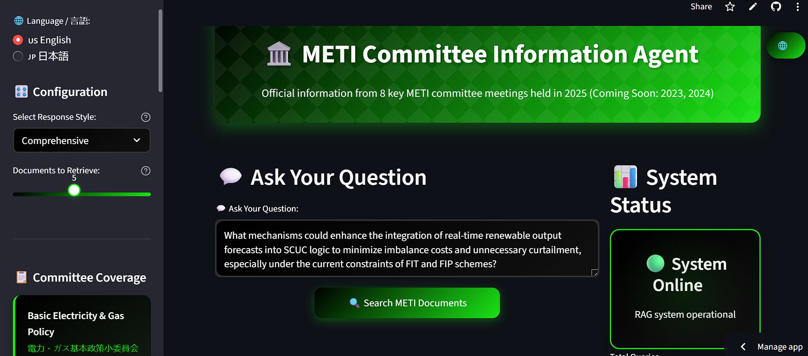
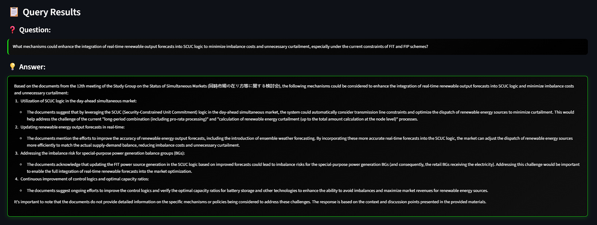

# 🏛️ METI AI Assistant

An intelligent document search and Q&A system for Japan's Ministry of Economy, Trade and Industry (METI) committee meetings. This RAG (Retrieval-Augmented Generation) powered assistant provides accurate, sourced information from official METI committee documents. This project was created in partnership with Agile Energy X and TEPCO japan. 

## 📸 Application Screenshots

### Main Interface

*Bilingual interface with Japanese language support and comprehensive METI committee coverage*

### Query Results

*Detailed answers with source citations from official METI committee documents*

## 🌟 Features

- **🤖 AI-Powered Q&A**: Ask questions about Japanese energy policy in English or Japanese
- **🌐 Bilingual Support**: Full Japanese (日本語) and English language interface
- **📚 Official Sources**: Information from 8 key METI committee meetings (2025)
- **🔍 Smart Retrieval**: RAG system with configurable document retrieval
- **📊 Interactive UI**: Modern, responsive interface with real-time search
- **📝 Query History**: Track and review previous searches
- **🎯 Source Citations**: Every answer includes source documents and metadata

## 🏗️ Architecture

```
┌─────────────────┐    ┌─────────────────┐    ┌─────────────────┐
│   Streamlit UI  │────│  LangChain RAG  │────│   AWS Bedrock   │
│                 │    │                 │    │   (Claude AI)   │
└─────────────────┘    └─────────────────┘    └─────────────────┘
         │                       │                       
         │              ┌─────────────────┐              
         └──────────────│   Pinecone DB   │              
                        │  (Vector Store) │              
                        └─────────────────┘              
```

## 📋 Committee Coverage

The system contains official documents from these METI committees:

| Committee | Japanese Name 
|-----------|---------------
| **Basic Electricity & Gas Policy** | 電力・ガス基本政策小委員会 
| **Renewable Energy & Networks** | 再生可能エネルギー大量導入・次世代電力ネットワーク小委員会 
| **Next Generation Power System** | 次世代電力系統ワーキンググループ 
| **Distributed Power Systems** | 次世代の分散型電力システムに関する検討会 
| **Watt Bit Collaboration** | ワット・ビット連携官民懇談会 
| **Carbon Management** | カーボンマネジメント小委員会 
| **Simultaneous Markets** | 同時市場の在り方等に関する検討会 
| **Adjustment Capacity** | 調整力及び需給バランス評価等に関する委員会 

## 🚀 Quick Start

### Prerequisites

- Python 3.8+
- AWS Account with Bedrock access
- Pinecone account and API key
- Streamlit account (for deployment)

### Installation

1. **Clone the repository**
   ```bash
   git clone https://github.com/Arghaweeb/METI-AI-Assistant-.git
   cd METI-AI-Assistant-
   ```

2. **Create virtual environment**
   ```bash
   python -m venv venv
   source venv/bin/activate  # On Windows: venv\Scripts\activate
   ```

3. **Install dependencies**
   ```bash
   pip install -r requirements.txt
   ```

4. **Set up environment variables**
   
   Create a `.env` file:
   ```env
   AWS_REGION=your-aws-region
   PINECONE_API_KEY=your-pinecone-api-key
   PINECONE_INDEX_NAME=your-index-name
   PINECONE_NAMESPACE=your-namespace
   ```

5. **Run the application**
   ```bash
   streamlit run app.py
   ```

## 🔧 Configuration

### Streamlit Secrets (for deployment)

Add these secrets in your Streamlit Cloud dashboard:

```toml
[default]
AWS_REGION = "your-aws-region"
PINECONE_API_KEY = "your-pinecone-api-key"
PINECONE_INDEX_NAME = "your-index-name"
PINECONE_NAMESPACE = "your-namespace"
```

### Response Styles

- **Comprehensive**: Detailed answers with full context and citations
- **Simple**: Concise, direct answers

### Retrieval Configuration

- Adjust document retrieval count (1-10 documents)
- Higher count = more comprehensive but slower responses

## 🛠️ Tech Stack

- **Frontend**: Streamlit with custom CSS
- **Backend**: Python, LangChain
- **Vector Database**: Pinecone
- **LLM**: AWS Bedrock (Claude 3 Haiku)
- **Embeddings**: Amazon Titan Embed Text v2
- **Deployment**: Streamlit Cloud

## 📊 Usage Examples

### English Queries
```
What external changes are impacting Japan's electricity system?
How is Japan addressing carbon management?
What are the main challenges in grid modernization?
```

### Japanese Queries (日本語)
```
日本の電力システムに影響を与える外部変化は何ですか？
電力市場の改革について教えてください
再生可能エネルギーの導入課題について説明してください
```

## 🔒 Security & Privacy

- All API keys are stored securely using Streamlit secrets
- No user data is stored or logged
- All queries are processed in real-time
- Source documents are official METI publications

## 🤝 Contributing

1. Fork the repository
2. Create a feature branch (`git checkout -b feature/amazing-feature`)
3. Commit your changes (`git commit -m 'Add amazing feature'`)
4. Push to the branch (`git push origin feature/amazing-feature`)
5. Open a Pull Request

## 📞 Support

- **Issues**: [GitHub Issues](https://github.com/Arghaweeb/METI-AI-Assistant-/issues)
- **Discussions**: [GitHub Discussions](https://github.com/Arghaweeb/METI-AI-Assistant-/discussions)

## 🙏 Acknowledgments

- **METI (経済産業省)**: For providing official committee meeting documents
- **AWS Bedrock**: For powerful LLM capabilities
- **Pinecone**: For efficient vector search
- **Streamlit**: For the amazing web framework
- **LangChain**: For RAG orchestration

## 📈 Roadmap

- [ ] Add 2023 committee meeting documents
- [ ] Implement advanced search filters
- [ ] Add document upload functionality
- [ ] Multi-modal support (images, charts)
- [ ] API endpoint for external integration
- [ ] Advanced analytics dashboard

---

## 📄 Requirements

Create a `requirements.txt` file with these dependencies:

```txt
streamlit>=1.28.0
langchain>=0.1.0
langchain-pinecone>=0.1.0
langchain-aws>=0.1.0
pinecone-client>=3.0.0
python-dotenv>=1.0.0
boto3>=1.34.0
```

## 🚨 Important Notes

### Environment Setup
- Ensure your AWS credentials are properly configured
- Your AWS account must have access to Bedrock services
- Pinecone index should be created with appropriate dimensions for Titan embeddings

### Data Processing
- The knowledge base contains 400+ PDF documents from METI committees
- Documents are stored in AWS S3 and vectorized in Pinecone
- System supports both English and Japanese text processing

### Performance Optimization
- Vector search is optimized for sub-second response times
- Caching is implemented for frequently accessed documents
- RAG system uses semantic similarity for accurate retrieval
